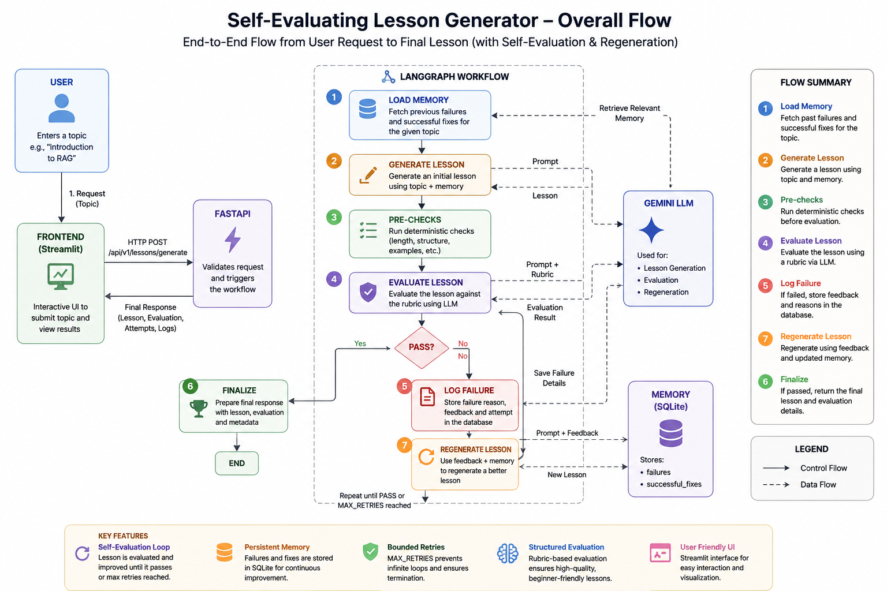

# Self-Evaluating Lesson Generator

An agentic lesson-generation system that generates beginner-friendly educational content, evaluates it against a strict rubric, and automatically regenerates the lesson when it fails evaluation.

Built with **Python, LangGraph, Gemini, FastAPI, Streamlit, SQLite, and Pydantic**.

---

## Architecture



## 🚀 How to Run

### 1. Clone the repository

```bash
git clone https://github.com/YOUR_USERNAME/self-evaluating-lesson-generator.git
cd self-evaluating-lesson-generator
```

### 2. Create and activate a virtual environment

**macOS/Linux:**

```bash
python3 -m venv .venv
source .venv/bin/activate
```

**Windows:**

```powershell
python -m venv .venv
.venv\Scripts\activate
```

### 3. Install dependencies

```bash
pip install -r requirements.txt
```

### 4. Configure Gemini

Create a `.env` file in the project root:

```env
GEMINI_API_KEY=your_gemini_api_key
GEMINI_MODEL=your_gemini_model

MAX_RETRIES=2
DATABASE_PATH=data/memory.db

DEMO_FAILURE=false
```

Get a Gemini API key from Google AI Studio.

**Do not commit `.env` to GitHub.**

### 5. Start FastAPI

```bash
uvicorn app.main:app --reload
```

The API will be available at:

```text
http://localhost:8000
```

API documentation:

```text
http://localhost:8000/docs
```

### 6. Start Streamlit

Open another terminal, activate the virtual environment, and run:

```bash
streamlit run frontend/streamlit_app.py
```

Open the URL shown by Streamlit, usually:

```text
http://localhost:8501
```

Enter a topic such as:

```text
Introduction to RAG
```

and click **Generate Lesson**.

---

## 🧪 Test the Failure & Regeneration Flow

The project includes a deliberate failure mode to demonstrate the self-evaluation loop.

In `.env`, set:

```env
DEMO_FAILURE=true
```

Then restart the application and generate a lesson.

The first attempt will contain a deliberate incorrect statement. The expected flow is:

```text
Generate
   ↓
Evaluate
   ↓
FAIL
   ↓
Log Failure
   ↓
Regenerate
   ↓
Evaluate Again
   ↓
PASS
```

The UI should show multiple attempts and the rejection details.

After testing, set:

```env
DEMO_FAILURE=false
```

---

# Architecture

```text
User
  │
  ▼
Streamlit
  │
  │ HTTP POST
  ▼
FastAPI
  │
  ▼
LangGraph
  │
  ├── Load Memory
  │
  ├── Generate ───────► Gemini
  │
  ├── Pre-check
  │
  ├── Evaluate ───────► Gemini
  │
  ├── PASS ───────────► Finalize
  │
  └── FAIL
        │
        ▼
     Log Failure
        │
        ▼
      SQLite
        │
        ▼
     Regenerate ──────► Gemini
        │
        ▼
     Evaluate Again
```

---

# How It Works

### 1. User Request

The user enters a topic through the Streamlit frontend.

Streamlit sends a request to:

```text
POST /api/v1/lessons/generate
```

Example:

```json
{
  "topic": "Introduction to RAG"
}
```

### 2. FastAPI

FastAPI validates the request using Pydantic and starts the LangGraph workflow.

### 3. Load Memory

The workflow retrieves previous failures and successful fixes for the requested topic from SQLite.

This memory is provided to the generator so previous mistakes can be avoided.

### 4. Generate

The Generator sends the topic and relevant memory to Gemini and creates a complete beginner-friendly lesson.

### 5. Pre-check

Simple deterministic checks are performed before the LLM evaluator.

Examples include:

* Lesson is not empty
* Reasonable lesson length
* What/why/how are covered
* At least one example is present

### 6. Evaluate

The Evaluator sends the lesson and the rubric to Gemini.

The evaluator returns structured results containing:

* Overall pass/fail
* Individual criterion results
* Reasons for failures
* Evaluation summary

### 7. Conditional Routing

LangGraph checks the evaluation result.

If the lesson passes:

```text
Evaluate → Finalize → END
```

If it fails and retries remain:

```text
Evaluate → Log Failure → Regenerate → Evaluate
```

### 8. Persistent Memory

Failed attempts are stored in SQLite.

The project uses two tables:

```text
failures
successful_fixes
```

This allows future runs to use previous feedback.

### 9. Bounded Retries

The workflow uses `MAX_RETRIES` to prevent infinite regeneration loops.

If the lesson continues to fail after the maximum number of retries, the workflow stops with a failure status.

---

# Project Structure

```text
self-evaluating-lesson-generator/
│
├── app/
│   ├── agents/
│   │   ├── generator.py
│   │   ├── evaluator.py
│   │   └── regenerator.py
│   │
│   ├── api/
│   │   └── lessons.py
│   │
│   ├── evaluation/
│   │   ├── rubric.py
│   │   └── schemas.py
│   │
│   ├── memory/
│   │   └── database.py
│   │
│   ├── workflow/
│   │   ├── graph.py
│   │   └── state.py
│   │
│   ├── config.py
│   └── main.py
│
├── frontend/
│   └── streamlit_app.py
│
├── tests/
│   ├── test_checks.py
│   ├── test_generator.py
│   ├── test_memory.py
│   └── test_workflow.py
│
├── .gitignore
├── requirements.txt
└── README.md
```

---

# Tech Stack

| Technology | Purpose                                     |
| ---------- | ------------------------------------------- |
| Python     | Application development                     |
| LangGraph  | Workflow orchestration and state management |
| Gemini     | Generation, evaluation and regeneration     |
| FastAPI    | REST API                                    |
| Streamlit  | User interface                              |
| SQLite     | Persistent memory                           |
| Pydantic   | Validation and structured outputs           |
| Uvicorn    | API server                                  |

---

# Key Design Decisions

### LangGraph

Used to manage the stateful workflow, conditional routing, and regeneration loop.

### FastAPI

Separates the API layer from the AI workflow and provides request validation and Swagger documentation.

### Gemini

Used for lesson generation, independent evaluation, and regeneration.

### SQLite

Provides simple persistent memory without requiring an external database server.

### Deterministic Pre-checks

Basic content checks are handled with Python before invoking the evaluator, reducing unnecessary LLM calls.

---

# Example Workflow

For a topic such as:

```text
Introduction to RAG
```

A successful first attempt looks like:

```text
Generate → Pre-check → Evaluate → PASS → Finalize
```

If the lesson fails:

```text
Generate
   ↓
Evaluate
   ↓
FAIL
   ↓
Store failure
   ↓
Regenerate
   ↓
Evaluate
   ↓
PASS
```

The final response contains the lesson, evaluation results, number of attempts, and rejection log.

---

# Environment Variables

| Variable         | Description                          |
| ---------------- | ------------------------------------ |
| `GEMINI_API_KEY` | Gemini API key                       |
| `GEMINI_MODEL`   | Gemini model used by the application |
| `MAX_RETRIES`    | Maximum regeneration attempts        |
| `DATABASE_PATH`  | SQLite database path                 |
| `DEMO_FAILURE`   | Enables deliberate failure testing   |

---

# License

This project was created as a technical take-home assignment.
